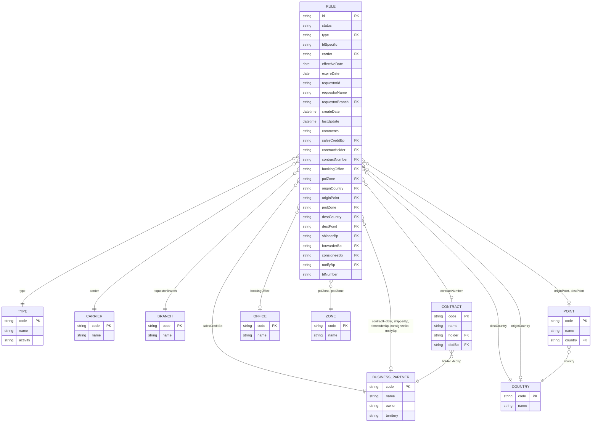

# CV-UCV-Exeption – Sales Credit Rules

Website to create and manage Sales Credit exception rules (CMA CGM style).
Site web pour créer et gérer les règles d'exception Sales Credit (style CMA CGM).

- **Frontend:** React + Vite (http://localhost:5173)
- **Backend:** Node.js + Express API with an **in-memory database** (http://localhost:3001)
- **Excel export:** Python script (`scripts/export_to_excel.py`)

> ⚠️ The database is in memory: **all data is lost when the server stops**.
> ⚠️ La base de données est en mémoire : **toutes les données sont perdues à l'arrêt du serveur**.

**Languages / Langues:** [English](#-english) | [Français](#-français)

---

## 🇬🇧 English

### 1. Prerequisites (install once)

| Tool | Version | Required? | Download | Check it works |
|------|---------|-----------|----------|----------------|
| Git | any | Yes | https://git-scm.com/downloads | `git --version` |
| Node.js (includes npm) | 18 or newer (LTS recommended) | Yes | https://nodejs.org | `node -v` and `npm -v` |
| Python | 3.9 or newer | Only for the Excel export | https://www.python.org/downloads | `py --version` (Windows) or `python3 --version` |

> 💡 When installing Python on Windows, tick **"Add python.exe to PATH"**.
> 💡 After installing a tool, **close and reopen** your terminal so it is detected.

### 2. Get the project

Open a terminal (PowerShell on Windows, Terminal on macOS/Linux) and run:

```bash
git clone https://github.com/ho-ncorreia/CV-UCV-Exeption.git
cd CV-UCV-Exeption
```

### 3. Install the dependencies (first time only)

```bash
npm install
```

This creates a `node_modules` folder. It can take a minute.

For the Excel export (optional):

```bash
# Windows
py -m pip install -r scripts/requirements.txt
# macOS / Linux
python3 -m pip install -r scripts/requirements.txt
```

### 4. Start the application

```bash
npm run dev
```

This starts **two** processes in the same terminal:
- `[api]` the backend on port **3001**
- `[web]` the website on port **5173**

Wait until you see `Local: http://localhost:5173/`, then open **http://localhost:5173** in your browser.

> Keep the terminal open: closing it stops the application.

### 5. Use the application

- **Rules list:** search, filter, **+ Create**, **Edit**, **Copy**, **Delete**.
- **Form:** fill the fields marked with `*`, then click **Save**. The icon next to a field opens a search list.
- **Export Excel:** button on the list screen. It opens a new tab, runs the Python script and downloads the `.xlsx` file. Files are also saved in the `exports/` folder.

You can also run the export from a terminal (the application must be running):

```bash
py scripts/export_to_excel.py --output rules.xlsx       # Windows
python3 scripts/export_to_excel.py --output rules.xlsx  # macOS / Linux
```

### 6. Stop the application

In the terminal where it runs, press **Ctrl + C** (answer `Y` if asked).

### 7. Troubleshooting

| Problem | Solution |
|---------|----------|
| `npm.ps1 cannot be loaded because running scripts is disabled` (Windows) | Use `npm.cmd` instead of `npm` (e.g. `npm.cmd install`, `npm.cmd run dev`), **or** run once: `Set-ExecutionPolicy -Scope CurrentUser RemoteSigned` |
| `'node'`, `'npm'`, `'git'` or `'py'` is not recognized | The tool is not installed or not in the PATH. Reinstall it, then reopen the terminal. |
| `EADDRINUSE` / port 3001 or 5173 already in use | The app is already running in another terminal. Stop it (Ctrl + C) or close that terminal. |
| The page shows `Cannot reach API` | The backend is not running. Check the `[api]` lines in the terminal and restart `npm run dev`. |
| Excel export fails: Python not found | Install Python, or tell the server where it is: `$env:PYTHON="C:\path\to\python.exe"; npm run dev` (PowerShell) or `PYTHON=/usr/bin/python3 npm run dev` (macOS/Linux). |
| Excel export fails: `No module named 'openpyxl'` | Run the pip command from step 3. |
| My rules disappeared | Normal: data is stored in memory and is reset at each restart. |

---

## 🇫🇷 Français

### 1. Prérequis (à installer une seule fois)

| Outil | Version | Obligatoire ? | Téléchargement | Vérifier l'installation |
|-------|---------|---------------|----------------|-------------------------|
| Git | toutes | Oui | https://git-scm.com/downloads | `git --version` |
| Node.js (inclut npm) | 18 ou plus (LTS conseillée) | Oui | https://nodejs.org | `node -v` et `npm -v` |
| Python | 3.9 ou plus | Uniquement pour l'export Excel | https://www.python.org/downloads | `py --version` (Windows) ou `python3 --version` |

> 💡 Lors de l'installation de Python sous Windows, cochez **« Add python.exe to PATH »**.
> 💡 Après l'installation d'un outil, **fermez et rouvrez** votre terminal pour qu'il soit reconnu.

### 2. Récupérer le projet

Ouvrez un terminal (PowerShell sous Windows, Terminal sous macOS/Linux) et lancez :

```bash
git clone https://github.com/ho-ncorreia/CV-UCV-Exeption.git
cd CV-UCV-Exeption
```

### 3. Installer les dépendances (la première fois seulement)

```bash
npm install
```

Cela crée un dossier `node_modules`. Cela peut prendre une minute.

Pour l'export Excel (optionnel) :

```bash
# Windows
py -m pip install -r scripts/requirements.txt
# macOS / Linux
python3 -m pip install -r scripts/requirements.txt
```

### 4. Lancer l'application

```bash
npm run dev
```

Cette commande démarre **deux** processus dans le même terminal :
- `[api]` le serveur (backend) sur le port **3001**
- `[web]` le site web sur le port **5173**

Attendez de voir `Local: http://localhost:5173/`, puis ouvrez **http://localhost:5173** dans votre navigateur.

> Laissez le terminal ouvert : le fermer arrête l'application.

### 5. Utiliser l'application

- **Liste des règles :** recherche, filtre, **+ Create** (créer), **Edit** (modifier), **Copy** (dupliquer), **Delete** (supprimer).
- **Formulaire :** remplissez les champs marqués d'une `*`, puis cliquez sur **Save**. L'icône à côté d'un champ ouvre une liste de recherche.
- **Export Excel :** bouton sur l'écran de liste. Il ouvre un nouvel onglet, exécute le script Python et télécharge le fichier `.xlsx`. Les fichiers sont aussi enregistrés dans le dossier `exports/`.

Vous pouvez aussi lancer l'export depuis un terminal (l'application doit être démarrée) :

```bash
py scripts/export_to_excel.py --output regles.xlsx       # Windows
python3 scripts/export_to_excel.py --output regles.xlsx  # macOS / Linux
```

### 6. Arrêter l'application

Dans le terminal où elle tourne, appuyez sur **Ctrl + C** (répondez `O` ou `Y` si demandé).

### 7. Problèmes fréquents

| Problème | Solution |
|----------|----------|
| `Impossible de charger le fichier npm.ps1, car l'exécution de scripts est désactivée` (Windows) | Utilisez `npm.cmd` au lieu de `npm` (ex. `npm.cmd install`, `npm.cmd run dev`), **ou** lancez une fois : `Set-ExecutionPolicy -Scope CurrentUser RemoteSigned` |
| `'node'`, `'npm'`, `'git'` ou `'py'` n'est pas reconnu | L'outil n'est pas installé ou pas dans le PATH. Réinstallez-le puis rouvrez le terminal. |
| `EADDRINUSE` / port 3001 ou 5173 déjà utilisé | L'application tourne déjà dans un autre terminal. Arrêtez-la (Ctrl + C) ou fermez ce terminal. |
| La page affiche `Cannot reach API` | Le serveur ne tourne pas. Regardez les lignes `[api]` dans le terminal et relancez `npm run dev`. |
| L'export Excel échoue : Python introuvable | Installez Python, ou indiquez son chemin au serveur : `$env:PYTHON="C:\chemin\vers\python.exe"; npm run dev` (PowerShell) ou `PYTHON=/usr/bin/python3 npm run dev` (macOS/Linux). |
| L'export Excel échoue : `No module named 'openpyxl'` | Lancez la commande pip de l'étape 3. |
| Mes règles ont disparu | Normal : les données sont en mémoire et sont réinitialisées à chaque redémarrage. |

---

## Project structure / Structure du projet

```
├── server/
│   ├── index.js          # Express API (CRUD + export)
│   └── db.js             # In-memory database / Base de données en mémoire
├── src/                  # React frontend
│   ├── App.jsx           # Form / Formulaire
│   ├── RuleList.jsx      # Rules list / Liste des règles
│   ├── ExportTask.jsx    # Export tab / Onglet d'export
│   └── styles.css
├── scripts/
│   ├── export_to_excel.py
│   └── requirements.txt
├── exports/              # Generated Excel files / Fichiers Excel générés (ignored by git)
├── package.json
└── vite.config.js
```

---

## Data model / Modèle de données

Defined in / Défini dans [server/db.js](server/db.js). All tables are JavaScript arrays held in memory.
Toutes les tables sont des tableaux JavaScript gardés en mémoire.

- **`rules`**: the only editable table (CRUD) / la seule table modifiable (CRUD).
- **`lookups.*`**: read-only reference tables (seed data) / tables de référence en lecture seule (données d'exemple).

### Diagram / Diagramme



### Table `rules`

| Field / Champ | Type | Required / Obligatoire | Reference / Référence | Description (EN / FR) |
|---|---|---|---|---|
| `id` | string | auto | – | Unique ID, generated from 1001 / Identifiant unique, généré à partir de 1001 |
| `status` | `Active` \| `Inactive` | ✅ | – | Rule status / Statut de la règle |
| `type` | string | ✅ | `types` | Rule type (gives the Activity) / Type de règle (donne l'Activité) |
| `blSpecific` | `Yes` \| `No` | ✅ | – | Rule for a specific BL / Règle pour un BL spécifique |
| `carrier` | string | ✅ | `carriers` | Carrier / Transporteur |
| `effectiveDate` | date `YYYY-MM-DD` | ✅ | – | Start of validity / Début de validité |
| `expireDate` | date `YYYY-MM-DD` | ✅ | – | End of validity (≥ effectiveDate) / Fin de validité (≥ effectiveDate) |
| `requestorId` | string | auto | – | Creator user ID / Identifiant du créateur |
| `requestorName` | string | auto | – | Creator name / Nom du créateur |
| `requestorBranch` | string | ✅ | `branches` | Requestor sales branch / Agence commerciale du demandeur |
| `createDate` | ISO datetime | auto | – | Creation date / Date de création |
| `lastUpdate` | ISO datetime | auto | – | Last modification date / Date de dernière modification |
| `comments` | string (max 1000) | – | – | Free comments / Commentaires libres |
| `salesCreditBp` | string | ✅ | `businessPartners` | Business partner receiving the sales credit / Partenaire qui reçoit le sales credit |
| `contractHolder` | string | – | `businessPartners` | Contract holder / Titulaire du contrat |
| `contractNumber` | string | – | `contracts` | Contract / Contrat |
| `bookingOffice` | string | – | `offices` | Booking office / Bureau de réservation |
| `polZone` | string | ✅ | `zones` | Port of loading zone / Zone du port de chargement |
| `originCountry` | string | – | `countries` | Origin country / Pays d'origine |
| `originPoint` | string | – | `points` | Origin point (must be in originCountry) / Point d'origine (doit être dans originCountry) |
| `podZone` | string | ✅ | `zones` | Port of discharge zone / Zone du port de déchargement |
| `destCountry` | string | ✅ | `countries` | Destination country / Pays de destination |
| `destPoint` | string | – | `points` | Destination point (must be in destCountry) / Point de destination (doit être dans destCountry) |
| `shipperBp` | string | – | `businessPartners` | Shipper / Chargeur |
| `forwarderBp` | string | – | `businessPartners` | Forwarder / Transitaire |
| `consigneeBp` | string | – | `businessPartners` | Consignee / Destinataire |
| `notifyBp` | string | – | `businessPartners` | Notify party / Partie à notifier |
| `blNumber` | string | if / si `blSpecific = Yes` | – | Bill of Lading number / Numéro de connaissement |

`auto` = set by the server / renseigné par le serveur.

### Reference tables / Tables de référence (`lookups`)

| Table | Fields / Champs | Content / Contenu | Example / Exemple |
|---|---|---|---|
| `types` | `code`, `name`, `activity` | Rule types / Types de règle | `DSC_BB` → activity `BB` |
| `carriers` | `code`, `name` | Carriers / Transporteurs | `00000000` CMA CGM |
| `branches` | `code`, `name` | Sales branches / Agences commerciales | `FRMRS` Marseille Head Office |
| `businessPartners` | `code`, `name`, `owner`, `territory` | Business partners / Partenaires commerciaux | `0000100001` Global Freight SAS |
| `contracts` | `code`, `name`, `holder`, `dcdBp` | Contracts / Contrats | `CT2026000001` FAK Asia - Europe 2026 |
| `offices` | `code`, `name` | Booking offices / Bureaux de réservation | `MRS01` Marseille Booking Office |
| `zones` | `code`, `name` | Trigram zones / Zones trigramme | `MED` Mediterranean |
| `countries` | `code`, `name` | Countries (ISO) / Pays (ISO) | `FR` France |
| `points` | `code`, `name`, `country` | Ports (UN/LOCODE) | `FRMRS` Marseille |

To change the reference data, edit [server/db.js](server/db.js) and restart the server.
Pour modifier les données de référence, éditez [server/db.js](server/db.js) puis redémarrez le serveur.
