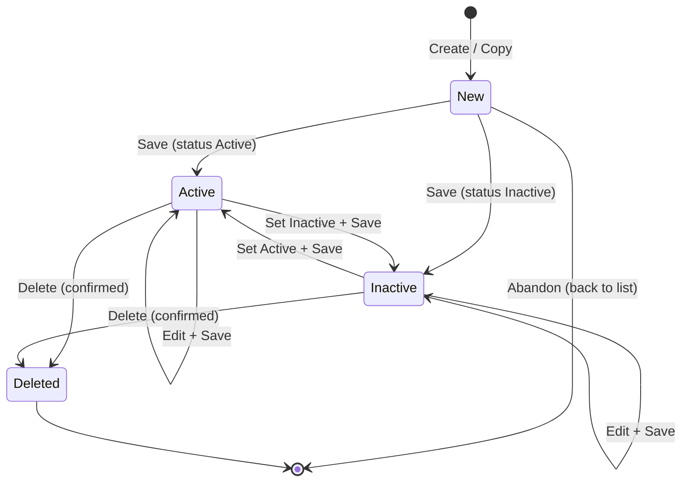
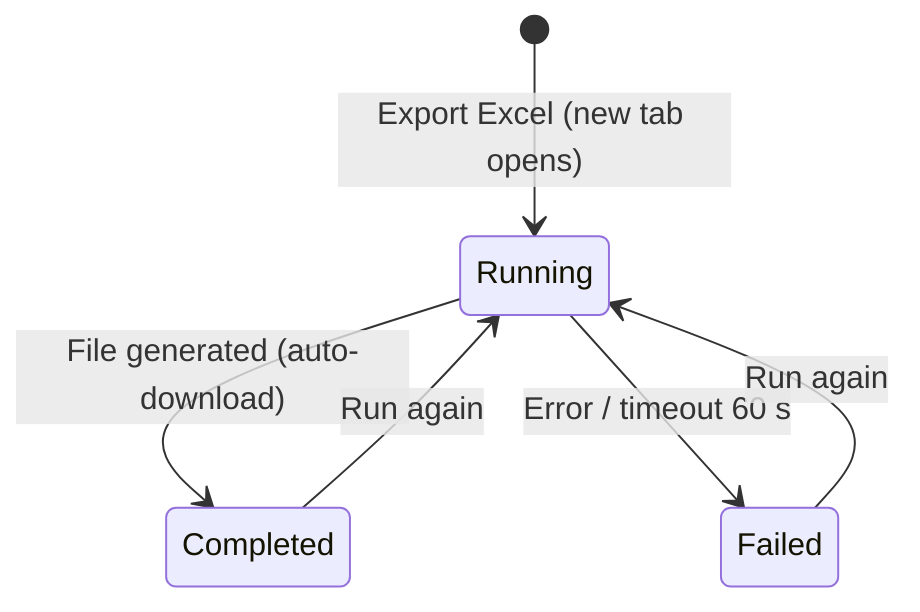
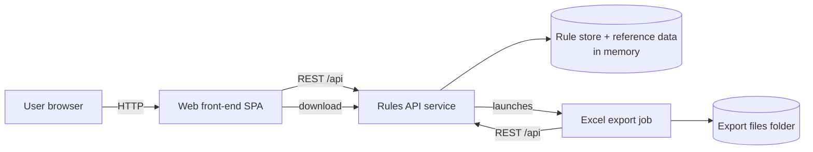
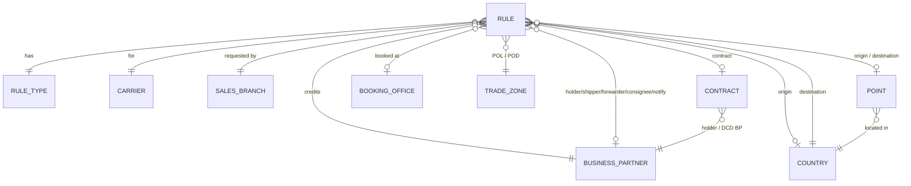

# Sales Credit Rules – Requirements Document

> Reverse-engineered from the existing application (frontend, backend, in-memory data model, export script).
> Inferred items are flagged with **Assumption / Confidence / Reason**. Ambiguities list alternatives and a recommended interpretation.

---

# 1. Business Requirements Document

## 1.1 Business Context

**Why the application exists**
In a shipping company (CMA CGM group carriers), the commercial performance of sales people and sales branches is measured through *sales credit*: the attribution of a shipment's revenue/volume to a customer (Business Partner) and therefore to the sales owner and territory responsible for that customer. Default attribution logic does not always reflect commercial reality (e.g. a forwarder books, but the deal was negotiated with a contract holder or a shipper in another territory).

The application lets commercial staff declare **Sales Credit Rules**: exceptions that say *"for shipments matching these criteria (carrier, route, contract, parties, BL), during this validity period, credit the sales to this Business Partner."*

**Business problem solved**
- Removes manual, untraceable re-allocations of sales credit.
- Centralises exception rules in one referential, with a requestor, a validity period and a status.
- Provides an extract (Excel) for controllers, sales operations and downstream systems.

**Expected business outcomes**
- Fair and transparent sales performance measurement across territories.
- Fewer disputes between sales owners/branches.
- Auditable list of exceptions with who requested them and when.

```
Assumption: The rules are consumed by a downstream sales-credit allocation process (not part of this application).
Confidence: Medium
Reason: The application only stores and exports rules; no evaluation of shipments exists, and the export targets a spreadsheet.
```

## 1.2 Business Objectives

| # | Objective |
|---|-----------|
| BO-1 | Allow sales users to create, maintain and retire Sales Credit exception rules. |
| BO-2 | Guarantee rule quality: mandatory criteria, valid reference codes, coherent dates and geography. |
| BO-3 | Show business context while editing (BP names, sales owner, territory, contract DCD BP, activity) to avoid mistakes. |
| BO-4 | Provide an on-demand Excel extract of all rules and reference data. |
| BO-5 | Keep traceability of the requestor, requesting branch, creation and last-update dates. |

## 1.3 Stakeholders

| Stakeholder | Interest |
|---|---|
| Sales representatives / Key account managers | Ensure their deals are credited correctly. |
| Sales branch managers | Territory performance accuracy. |
| Sales operations / Sales administration | Maintain the rules (main users). |
| Sales controlling / Finance | Consume the Excel extract for reporting and reconciliation. |
| IT / Data owners | Maintain reference data (BPs, contracts, zones, ports). |

## 1.4 Users and Roles

| Role | Description | Status in current app |
|---|---|---|
| Rule Requestor (Sales user) | Creates and edits rules; recorded as requestor. | Implemented (single mocked user) |
| Rule Viewer / Controller | Consults and exports rules. | Same permissions as requestor |
| Reference Data Administrator | Maintains carriers, BPs, contracts, zones, countries, points, offices, branches, rule types. | Not implemented in UI (static data) |

```
Assumption: All users currently share one role with full rights.
Confidence: High
Reason: No authentication or authorization exists; the requestor is a fixed demo identity.
```

## 1.5 Functional Capabilities

```yaml
- Capability: Rule Consultation
  Description: List all sales credit rules with free-text search and status filter.
  Users: [Rule Requestor, Controller]
  Triggers: Opening the application; Refresh action
  Outcomes: Filtered list of rules with key criteria and validity.

- Capability: Rule Creation
  Description: Capture a new exception rule with criteria, beneficiary BP and validity period.
  Users: [Rule Requestor]
  Triggers: "Create" action, or "New" from the form
  Outcomes: Rule stored with a unique sequential ID, requestor and creation date.

- Capability: Rule Maintenance
  Description: Open an existing rule (from the list or by ID), modify and save it.
  Users: [Rule Requestor]
  Triggers: Row click, Edit action, ID search
  Outcomes: Rule updated; last-update date refreshed; requestor unchanged.

- Capability: Rule Duplication
  Description: Create a new rule pre-filled from an existing one.
  Users: [Rule Requestor]
  Triggers: Copy action (list or form)
  Outcomes: Unsaved new rule with copied criteria; current user becomes requestor.

- Capability: Rule Deletion
  Description: Permanently remove a rule after confirmation.
  Users: [Rule Requestor]
  Triggers: Delete action (list or form)
  Outcomes: Rule removed from the referential.

- Capability: Rule Activation / Deactivation
  Description: Mark a rule Active or Inactive without deleting it.
  Users: [Rule Requestor]
  Triggers: Status choice in the form, then Save
  Outcomes: Rule status changed.

- Capability: Reference Data Lookup (Value Help)
  Description: Search and pick valid codes for carriers, branches, BPs, contracts, offices, zones, countries, points.
  Users: [Rule Requestor]
  Triggers: Value-help icon next to a field
  Outcomes: Valid code entered in the field.

- Capability: Contextual Information Derivation
  Description: Display names and business context derived from entered codes.
  Users: [Rule Requestor]
  Triggers: Any code entry
  Outcomes: BP names, sales owner, territory, contract DCD BP and its name, activity, location names shown.

- Capability: Excel Export (Reporting)
  Description: Generate a formatted Excel workbook of all rules and reference data, as a tracked task.
  Users: [Rule Requestor, Controller]
  Triggers: "Export Excel" action (opens a dedicated tab) or command-line execution
  Outcomes: Downloadable .xlsx file, execution status, duration and log.
```

## 1.6 Business Entities

```yaml
- Entity: Sales Credit Rule
  Description: An exception that redirects sales credit for matching shipments to a given Business Partner.
  BusinessPurpose: Core object managed by the application.
  Attributes:
    - Rule ID: unique, sequential, system-assigned, used by users to retrieve a rule
    - Status: Active | Inactive
    - Rule Type: determines the Activity (e.g. DSC_BB -> BB)
    - BL Specific: Yes | No – whether the rule targets one specific Bill of Lading
    - Carrier: group carrier brand concerned
    - Effective date / Expire date: validity period
    - Requestor (ID, name): person who created the rule
    - Requestor Sales Branch: branch requesting the exception
    - Comments: free justification (max 1000 chars)
    - Sales Credit BP: beneficiary of the sales credit (mandatory)
    - Contract Holder, Contract Number: optional contract criteria
    - Booking Office, POL Zone (mandatory), Origin Country, Origin Point: origin criteria
    - POD Zone (mandatory), Destination Country (mandatory), Destination Point: destination criteria
    - Shipper, Forwarder, Consignee, Notify Party BPs: optional party criteria
    - BL Number: mandatory when BL Specific = Yes
    - Creation date, Last update date: traceability
  Relationships:
    - Rule Type (1), Carrier (1), Sales Branch (1), Sales Credit BP (1)
    - Business Partner (0..1) for each of: contract holder, shipper, forwarder, consignee, notify
    - Contract (0..1), Booking Office (0..1)
    - Trade Zone (1) for POL and (1) for POD
    - Country (0..1) origin, (1) destination
    - Point (0..1) origin, (0..1) destination
  Lifecycle: New (unsaved) -> Active <-> Inactive -> Deleted

- Entity: Rule Type
  Description: Category of exception rule.
  BusinessPurpose: Classifies rules and determines the business Activity.
  Attributes: [Code, Description, Activity]
  Relationships: Used by many rules
  Lifecycle: Reference data (static)

- Entity: Carrier
  Description: Shipping line brand of the group (CMA CGM, APL, ANL, CNC, Mercosul Line).
  BusinessPurpose: Rules are scoped per carrier.
  Attributes: [Code, Name]
  Lifecycle: Reference data

- Entity: Sales Branch
  Description: Commercial branch/agency.
  BusinessPurpose: Identifies the requesting branch.
  Attributes: [Code, Name]
  Lifecycle: Reference data

- Entity: Business Partner
  Description: Customer or party (shipper, forwarder, consignee, contract holder...).
  BusinessPurpose: Beneficiary of sales credit or matching criterion.
  Attributes: [BP code, Name, Sales Credit Owner (sales person), Territory]
  Relationships: Referenced by rules and contracts
  Lifecycle: Reference data (master data)

- Entity: Contract
  Description: Commercial/service contract.
  BusinessPurpose: Criterion for rules; brings the contract holder and the DCD BP.
  Attributes: [Contract number, Description, Holder BP, DCD BP]
  Relationships: Holder -> Business Partner; DCD BP -> Business Partner
  Lifecycle: Reference data

- Entity: Booking Office
  Description: Office where the booking is made.
  Attributes: [Code, Name]
  Lifecycle: Reference data

- Entity: Trade Zone (Trigram)
  Description: Geographic trade zone identified by a 3-letter code (MED, NEU, ASI...).
  BusinessPurpose: Coarse origin (POL) and destination (POD) criteria.
  Attributes: [Trigram, Name]
  Lifecycle: Reference data

- Entity: Country
  Description: ISO country.
  Attributes: [ISO code, Name]
  Lifecycle: Reference data

- Entity: Point (Port / Location)
  Description: UN/LOCODE location.
  Attributes: [UN/LOCODE, Name, Country]
  Relationships: Belongs to one Country
  Lifecycle: Reference data
```

```
Assumption: "DCD BP" designates the Business Partner holding the commercial deal on the discharge/destination side of a contract.
Confidence: Low
Reason: Only the acronym and its relationship to Contract are visible.
- Alternative 1: Destination Commercial Deal BP
- Alternative 2: Delegated Contract Decision BP
- Recommended interpretation: Treat as "Contract DCD BP" (opaque business term) and confirm with business.
```

## 1.7 Business Rules

```yaml
- Type: Validation
  Rule: Type, BL Specific, Carrier, Effective date, Expire date, Requestor Sales Branch, Sales Credit BP, POL Zone, POD Zone and Destination Country are mandatory.
  Source: Rule save (server-side)
  Confidence: High

- Type: Validation
  Rule: Every code entered (type, carrier, branch, BPs, contract, office, zones, countries, points) must exist in its reference list.
  Source: Rule save
  Confidence: High

- Type: Validation
  Rule: Status must be Active or Inactive; BL Specific must be Yes or No.
  Source: Rule save
  Confidence: High

- Type: Condition
  Rule: When BL Specific = Yes, BL Number is mandatory. When BL Specific = No, BL Number is disabled and cleared.
  Source: Rule save + form behaviour
  Confidence: High

- Type: Constraint
  Rule: Expire date must not be earlier than Effective date (same day allowed).
  Source: Rule save
  Confidence: High

- Type: Constraint
  Rule: Dates must be valid calendar dates (YYYY-MM-DD).
  Source: Rule save
  Confidence: High

- Type: Constraint
  Rule: Origin Point must belong to Origin Country (if both given); Destination Point must belong to Destination Country (if both given).
  Source: Rule save; value help is filtered by selected country
  Confidence: High

- Type: Calculation / Derivation
  Rule: Activity is derived from the Rule Type.
  Source: Form
  Confidence: High

- Type: Derivation
  Rule: Sales Credit Owner Name and Territory are derived from the Sales Credit BP; "No Territory Found" is displayed when none.
  Source: Form
  Confidence: High

- Type: Derivation
  Rule: Contract DCD BP and its name are derived from the Contract Number.
  Source: Form
  Confidence: High

- Type: Derivation
  Rule: Selecting a Contract Number fills the Contract Holder with the contract's holder when Contract Holder is empty.
  Source: Form
  Confidence: High

- Type: Constraint
  Rule: Codes are entered in upper case; text values are trimmed; comments limited to 1000 characters, other fields to 100.
  Source: Form + rule save
  Confidence: High

- Type: Workflow Rule
  Rule: Rule ID is assigned by the system, sequential, starting at 1001; it cannot be changed.
  Source: Rule creation
  Confidence: High

- Type: Workflow Rule
  Rule: Requestor ID/name are recorded at creation and cannot be changed by later updates.
  Source: Rule update
  Confidence: High

- Type: Workflow Rule
  Rule: Creation date is set at creation; Last update date is refreshed at each save.
  Source: Rule creation/update
  Confidence: High

- Type: Workflow Rule
  Rule: A copied rule is a new rule: no ID, current user as requestor, new creation date, empty last update.
  Source: Copy action
  Confidence: High

- Type: Workflow Rule
  Rule: Deletion requires explicit user confirmation and is permanent.
  Source: Delete action
  Confidence: High

- Type: Constraint
  Rule: Export must finish within 60 seconds, otherwise it is reported as failed.
  Source: Export task
  Confidence: High

- Type: Authorization
  Rule: No authorization checks; any user can create, edit, delete and export any rule.
  Source: Whole application
  Confidence: High
```

```
Assumption: Inactive rules must be ignored by the downstream allocation process; rules outside their validity period are also not applied.
Confidence: Medium
Reason: Status and validity dates exist but are not used by any logic inside the application.
```

```
Assumption: Overlapping/duplicate rules are allowed.
Confidence: High (as-is) / Low (as desired)
Reason: No uniqueness or overlap check exists.
- Alternative 1: Allow overlaps; downstream applies the most specific rule.
- Alternative 2: Block overlapping active rules for the same criteria and period.
- Recommended interpretation: Warn (non-blocking) on overlap; to be confirmed by business.
```

## 1.8 Workflows

### Sales Credit Rule lifecycle



```yaml
Workflow: SalesCreditRuleLifecycle
  States: [New, Active, Inactive, Deleted]
  Transitions:
    - New -> Active|Inactive: Save with valid data (validation errors keep the rule in New)
    - Active <-> Inactive: Change status and save
    - Active|Inactive -> Active|Inactive: Edit and save (last update refreshed)
    - Active|Inactive -> Deleted: Delete with confirmation
  Triggers: [Create, Copy, Save, Delete, Status change]
  Approvals: none
```

### Excel export task



```yaml
Workflow: ExcelExportTask
  States: [Running, Completed, Failed]
  Transitions:
    - Running -> Completed: workbook generated; file downloadable
    - Running -> Failed: generation error, data source unavailable or timeout
    - Completed|Failed -> Running: Run again
  Triggers: [Export Excel button, Run again]
```

```
Assumption: No approval workflow is required today.
Confidence: Medium
Reason: No approver, approval status or notification exists; however, sales credit exceptions commonly require managerial approval.
- Alternative 1: Keep self-service creation (as-is).
- Alternative 2: Add Draft -> Submitted -> Approved/Rejected with branch manager approval.
- Recommended interpretation: As-is for rebuild; approval as a roadmap item.
```

## 1.9 User Stories

**Rule Consultation**
- As a Sales user, I want to see the list of all sales credit rules so that I know which exceptions exist.
- As a Sales user, I want to search rules by ID, BP code or name, contract, zone, country or comment so that I can find a rule quickly.
- As a Sales user, I want to filter rules by status so that I can focus on active exceptions.
- As a Sales user, I want to open a rule by typing its ID so that I can access it directly.

**Rule Creation**
- As a Sales user, I want to create a rule with a beneficiary BP, criteria and validity period so that sales credit is redirected correctly.
- As a Sales user, I want mandatory fields to be clearly marked and errors highlighted so that I can fix my input.
- As a Sales user, I want my identity and creation date recorded automatically so that the rule is traceable.

**Rule Maintenance**
- As a Sales user, I want to edit an existing rule so that it reflects new commercial agreements.
- As a Sales user, I want to deactivate a rule without deleting it so that I keep its history.
- As a Sales user, I want to delete an obsolete rule so that the referential stays clean.
- As a Sales user, I want to copy a rule so that I can create a similar one quickly.

**Reference Data Assistance**
- As a Sales user, I want to search reference values in a pop-up so that I enter only valid codes.
- As a Sales user, I want to see the names, sales owner and territory behind a BP code so that I avoid crediting the wrong customer.
- As a Sales user, I want the contract holder pre-filled from the contract so that I save time.
- As a Sales user, I want points proposed only for the selected country so that geography stays consistent.

**Reporting**
- As a Controller, I want to export all rules to Excel with code and name columns so that I can analyse and share them.
- As a Controller, I want to follow the export execution (status, duration, log) so that I know whether the file is reliable.
- As an IT operator, I want to run the export from the command line so that it can be scheduled.

## 1.10 Acceptance Criteria

```gherkin
Feature: Rule consultation
  Scenario: Display rules
    Given rules exist
    When the user opens the application
    Then the rule list shows ID, status, type, carrier, sales credit BP and name, contract, POL, POD, destination, effective, expire and last update

  Scenario: Free-text search
    Given rules exist
    When the user types "Global Freight" in the search box
    Then only rules whose sales credit BP name contains "Global Freight" are listed

  Scenario: Status filter
    Given active and inactive rules exist
    When the user selects "Inactive"
    Then only inactive rules are listed

  Scenario: Open by ID
    Given rule 1001 exists
    When the user enters 1001 in the ID field and confirms
    Then rule 1001 is displayed in the form

  Scenario: Unknown ID
    When the user enters an ID that does not exist
    Then the message "Rule <ID> not found" is displayed

Feature: Rule creation
  Scenario: Successful creation
    Given the user is on a new rule form
    And all mandatory fields contain valid values
    When the user clicks Save
    Then a new ID is assigned
    And the creation date and last update date are set
    And the message "Rule <ID> has been saved" is displayed

  Scenario: Missing mandatory field
    Given the Sales Credit BP is empty
    When the user clicks Save
    Then the rule is not saved
    And the Sales Credit BP field is highlighted with "Sales Credit BP is required"

  Scenario: Unknown code
    Given the user entered carrier "99999999"
    When the user clicks Save
    Then the carrier field shows 'Value "99999999" does not exist'

  Scenario: Invalid validity period
    Given Effective date is 2026-12-31 and Expire date is 2026-01-01
    When the user clicks Save
    Then the Expire date shows "Expire date must be after effective date"

  Scenario: Same-day validity
    Given Effective date equals Expire date
    When the user clicks Save
    Then the rule is saved

  Scenario: BL specific rule
    Given BL Specific = Yes and BL Number is empty
    When the user clicks Save
    Then BL Number shows "BL Number is required when BL Specific = Yes"

  Scenario: BL Number cleared
    Given BL Specific = Yes and a BL Number is entered
    When the user sets BL Specific = No
    Then BL Number is emptied and disabled

  Scenario: Point not in country
    Given Origin Country = FR and Origin Point = CNSHA
    When the user clicks Save
    Then Origin Point shows "Origin point is not in origin country"

Feature: Contextual derivations
  Scenario: Sales credit owner
    Given the user enters Sales Credit BP 0000100001
    Then BP name "Global Freight SAS", owner "Marie Dupont" and territory "EMEA - France" are displayed

  Scenario: Contract defaults holder
    Given Contract Holder is empty
    When the user selects contract CT2026000001
    Then Contract Holder becomes 0000100001
    And Contract DCD BP 0000100003 and its name are displayed

  Scenario: Contract does not override holder
    Given Contract Holder is 0000100002
    When the user selects contract CT2026000001
    Then Contract Holder remains 0000100002

  Scenario: Activity
    When the user selects type DSC_BB
    Then Activity shows "BB"

Feature: Rule maintenance
  Scenario: Update keeps requestor
    Given rule 1001 created by S00000001
    When another user edits and saves it
    Then the requestor remains S00000001 and the last update date is refreshed

  Scenario: Copy
    Given rule 1001 is displayed
    When the user clicks Copy
    Then a new unsaved rule with the same criteria is displayed without ID
    And the message "Copy of rule 1001 - save to create a new rule" is shown

  Scenario: Delete with confirmation
    Given rule 1001 exists
    When the user clicks Delete and confirms
    Then rule 1001 no longer appears in the list

  Scenario: Delete cancelled
    When the user clicks Delete and cancels the confirmation
    Then the rule is kept

Feature: Excel export
  Scenario: Successful export
    Given rules exist
    When the user clicks "Export Excel"
    Then a new tab shows status "Running"
    And then status "Completed", duration, file name and log
    And the file is downloaded automatically

  Scenario: Workbook content
    When the export completes
    Then the workbook contains a "Rules" sheet with one row per rule sorted by ID, a name column next to each code column, dates in DD.MM.YYYY
    And one sheet per reference list

  Scenario: Export failure
    Given the data source is unavailable
    When the export runs
    Then status "Failed" and the error log are displayed
```

## 1.11 Permissions Model

```yaml
- Role: Any user (as-is)
  Permissions: [View rules, Create, Edit, Copy, Delete, Activate/Deactivate, Export]
  Restrictions:
    - Cannot change Rule ID, requestor, creation date, last update date
    - Cannot maintain reference data from the UI
```

Recommended target model:

```yaml
- Role: Sales Requestor
  Permissions: [View, Create, Copy, Edit own rules, Deactivate own rules, Export]
  Restrictions: [Cannot delete rules of other branches]
- Role: Branch Manager
  Permissions: [All Sales Requestor rights for branch rules, Delete branch rules, Approve rules]
- Role: Sales Controller
  Permissions: [View, Export]
  Restrictions: [Read-only]
- Role: Administrator
  Permissions: [All, Reference data maintenance]
```

```
Assumption: Ownership should be based on the Requestor Sales Branch.
Confidence: Low
Reason: The branch is mandatory and immutable requestor data is kept, suggesting accountability per branch.
```

---

# 2. Functional Specifications

## 2.1 User Interfaces

- Single-page web application, corporate branding: navy blue (#04246A) header with red (#E30613) accents, logo "CMA CGM", centered title "Sales Credit Rules", current user name on the right.
- Tab bar under the header acting as breadcrumb: "SCR - Rules" (returns to list) + current context ("Rule <ID>", "New rule" or "Excel export").
- SAP Fiori-like dense form layout; labels of mandatory fields prefixed by red `*`; read-only fields greyed.
- Global message strip (success = green, error = red, info = blue), closable.

## 2.2 Screens

```yaml
- Page: Rule List (home)
  Purpose: Consult, search and launch actions on rules
  AccessibleRoles: [All users]
  Components:
    - Title with rule count
    - Search box (ID, type, carrier, BP code/name, contract, POL, POD, destination country, comments)
    - Status filter (All / Active / Inactive)
    - Table: ID, Status badge, Type, Carrier name, Sales Credit BP + name, Contract, POL, POD, Dest., Effective, Expire, Last update, Actions
  Actions: [Refresh, Export Excel (new tab), + Create, Row click = Edit, Edit, Copy, Delete]

- Page: Rule Form
  Purpose: Create, view and edit a rule
  AccessibleRoles: [All users]
  Components:
    - Toolbar: Back to list, Save, New, Copy (existing rule), Delete (existing rule), mode text ("Editing rule X" / "Creating a new rule")
    - Section Creation Process: ID + open button, Type, BL Specific, Carrier (+name), Status, Effective date, Requestor ID (+name, read-only), Create date (read-only), Expire date, Requestor Sales Branch Code (+name), Last update (read-only), Comments
    - Section Sales: Activity (derived), Sales Credit BP, Contract Holder, Contract Number; read-only Sales Credit BP Name, Contract Holder Name, Contract DCD BP, Sales Credit Owner Name, Sales Credit Owner Territory, Contract DCD BP Name
    - Section Origin: Booking Office, Trigram POL Zone, Origin Country, Origin Point (each with name)
    - Section Destination: Trigram POD Zone, Destination Country, Destination Point (each with name)
    - Section Actors: Shipper, Forwarder, Consignee, Notify Party BP codes with names
    - Section Additional conditions: BL Number (enabled only if BL Specific = Yes)
  Actions: [Save, New, Copy, Delete, Back, Open by ID, Value help]

- Page: Value Help (dialog)
  Purpose: Select a valid reference code
  Components: Search box, result table (columns depend on list), "No data found"
  Actions: [Select row, Close (×, click outside)]

- Page: Excel Export Task (new browser tab)
  Purpose: Run and follow the Excel export
  Components: Script name, status badge, start time, duration, file name, progress bar, execution log
  Actions: [Download file, Run again, Close tab]
```

## 2.3 Forms

| Field | Control | Mandatory | Value help / source | Derived display |
|---|---|---|---|---|
| ID | text + open button | – | – | – |
| Type | dropdown | ✅ | Rule types | Activity |
| BL Specific | radio Yes/No (default No) | ✅ | – | enables BL Number |
| Carrier | code + value help (default 00000000) | ✅ | Carriers | carrier name |
| Status | radio Active/Inactive (default Active) | ✅ | – | – |
| Effective date / Expire date | date pickers | ✅ | – | – |
| Requestor ID / Create date / Last update | read-only | auto | – | requestor name |
| Requestor Sales Branch Code | code + VH | ✅ | Branches | branch name |
| Comments | multi-line (1000) | – | – | – |
| Sales Credit BP | code + VH | ✅ | BPs | name, owner, territory |
| Contract Holder | code + VH | – | BPs | name |
| Contract Number | code + VH | – | Contracts | DCD BP + name; defaults holder |
| Booking Office | code + VH | – | Offices | name |
| Trigram POL / POD Zone | code + VH | ✅ | Zones | name |
| Origin Country | code + VH | – | Countries | name |
| Destination Country | code + VH | ✅ | Countries | name |
| Origin / Destination Point | code + VH filtered by country | – | Points | name |
| Shipper / Forwarder / Consignee / Notify BP | code + VH | – | BPs | name |
| BL Number | text | if BL Specific = Yes | – | – |

Errors are returned for all invalid fields at once; each invalid field is outlined in red with its message under it; the error clears as soon as the user modifies the field.

## 2.4 Search Features

- **Rule list**: case-insensitive "contains" search across ID, type, carrier, Sales Credit BP code and name, contract, POL, POD, destination country, comments; combined with status filter. Client-side, instant.
- **Open by ID**: exact match.
- **Value help**: case-insensitive "contains" on all displayed columns of the reference list; points filtered by selected country.

## 2.5 Dashboards

None.
```
Assumption: A dashboard (rules per status, branch, expiring soon) would be valuable.
Confidence: Low
Reason: Not implemented; typical need for controllers.
```

## 2.6 Notifications

In-app messages only:
- "Rule <ID> has been saved", "Rule <ID> has been deleted", "Copy of rule <ID> - save to create a new rule"
- "Please check the highlighted fields", "Rule <ID> not found", "Cannot reach API: ..."

No email or system notification.

## 2.7 Reports

**Excel export "Sales Credit Rules"** (file `sales_credit_rules_YYYYMMDD_HHMMSS.xlsx`)
- Sheet **Rules** (red tab): one row per rule sorted by ID; all rule attributes; a "<field> - Name" column after each coded field; dates DD.MM.YYYY, timestamps DD.MM.YYYY HH:MM.
- Sheets **Types, Carriers, Sales Branches, Business Partners, Contracts, Booking Offices, Zones, Countries, Points** (navy tabs) with all reference attributes.
- Formatting: navy bold white header, frozen header row, auto-filter, auto column width (10–50).
- Available from the UI (tracked task, auto-download, files kept on server) and from command line with optional output file name and data-source URL.

---

# 3. Operational Specifications

## 3.1 Logical Architecture



- Presentation: single-page application.
- Business/API layer: REST service owning validation and persistence.
- Data: in-process memory store (rules + static reference data) – reset at restart.
- Batch: export job executed on demand, reads data through the public API, writes a file.

## 3.2 Data Model



Reference seed data (sample): 3 rule types (DSC_BB/BB, DSC_CT/CT, DSC_RF/RF), 5 carriers, 5 branches, 6 BPs, 3 contracts, 4 booking offices, 7 zones, 8 countries, 10 points; 1 sample rule (ID 1001).

## 3.3 APIs

```yaml
- Endpoint: GET /api/lookups
  Purpose: Provide all reference lists
  BusinessAction: Load reference data for value help and derivations
  Inputs: none
  Outputs: {types, carriers, branches, businessPartners, contracts, offices, zones, countries, points}
  Rules: Read-only

- Endpoint: GET /api/rules
  Purpose: List rules
  BusinessAction: Consult rules
  Inputs: none
  Outputs: array of rules
  Rules: No pagination; no server-side filter

- Endpoint: GET /api/rules/{id}
  Purpose: Retrieve one rule
  BusinessAction: Open rule
  Inputs: rule ID
  Outputs: rule | 404 "Rule <id> not found"

- Endpoint: POST /api/rules
  Purpose: Create a rule
  BusinessAction: Create
  Inputs: rule attributes (unknown attributes ignored)
  Outputs: 201 created rule (with ID, creation and update dates) | 400 {message, errors{field: message}}
  Rules: All validation rules of §1.7

- Endpoint: PUT /api/rules/{id}
  Purpose: Update a rule
  BusinessAction: Edit / activate / deactivate
  Inputs: rule ID, rule attributes
  Outputs: updated rule | 400 validation errors | 404
  Rules: Same validations; requestor and creation date preserved; last update refreshed; full replacement of editable attributes

- Endpoint: DELETE /api/rules/{id}
  Purpose: Delete a rule
  BusinessAction: Delete
  Inputs: rule ID
  Outputs: 204 | 404

- Endpoint: POST /api/export
  Purpose: Run the Excel export
  BusinessAction: Generate report
  Inputs: none
  Outputs: {file, log, durationMs} | 500 {message, log, durationMs}
  Rules: Timeout 60 s; file name generated by the system

- Endpoint: GET /api/export/{file}
  Purpose: Download a generated export
  BusinessAction: Retrieve report
  Inputs: file name (must match sales_credit_rules_YYYYMMDD_HHMMSS.xlsx)
  Outputs: Excel file | 400 invalid name | 404
```

## 3.4 Integrations

- No external system integration. Reference data is static sample data.
```
Assumption: In production, reference data comes from master-data systems (BP/customer master, contract management, location referential, HR for requestor identity).
Confidence: Medium
Reason: Codes (BP 10 digits, UN/LOCODE, ISO countries, "S" user IDs) mimic SAP-style enterprise master data; the original screen is SAP-based.
```

## 3.5 Security

- No authentication; fixed demo identity ("Demo User", S00000001).
- API listens only on the local machine (loopback).
- Input hardening: only known attributes are accepted, values trimmed and length-limited; download names strictly validated (no path traversal); export job launched without shell interpretation.
- No authorization, no CSRF protection, no rate limiting, no HTTPS (local use only).

## 3.6 Audit

- Per rule: requestor ID/name, requesting branch, creation date, last update date.
- No change history, no "updated by", no deletion trace.

## 3.7 Logging

- Service start log only; export execution log returned to the user. No structured or persistent logging.

## 3.8 Scalability

- Single process, single instance; state in memory (no horizontal scaling, data lost at restart).
- Full list loaded in browser; acceptable for hundreds/low thousands of rules.

## 3.9 Performance Requirements

| Requirement | Target (inferred) |
|---|---|
| List / search response | Instant (< 1 s) for up to a few thousand rules |
| Save | < 1 s |
| Excel export | < 60 s (hard timeout) |
| Request payload | ≤ 100 KB |

---

# 4. Modernization Recommendations

| Area | Finding | Recommendation |
|---|---|---|
| Persistence | In-memory store; data lost at restart | Relational database (e.g. PostgreSQL) with migrations |
| Security | No authentication/authorization; requestor sent by client at creation | SSO (Azure AD / OIDC), roles of §1.11, requestor taken from identity token |
| Audit | No history of changes nor deletions | Audit trail table (who/when/before/after); soft delete |
| Concurrency | Last write wins | Optimistic locking (version / ETag) |
| Business rules | No overlap/duplicate detection; status and validity not used | Overlap warning; "expired" computed state; doc of how rules are applied downstream |
| Business rules | Missing documentation: DCD BP meaning, rule types meaning, priority between rules | Business glossary and priority rules |
| Workflow | No approval | Optional Draft → Submitted → Approved/Rejected with notifications |
| Reference data | Static sample data, no maintenance UI | Integrate master data (API/sync) or admin screens |
| Duplicated logic | Code→name resolution implemented both in UI and in export; required/validation messages only server-side | Single validation schema shared by UI and API (e.g. JSON Schema/Zod); export built from a server-side reporting service |
| Validation quirk | Invalid "BL Specific" value overrides the "required" message | Order validations / one message per field |
| Export | Files accumulate on server; Python runtime dependency; synchronous request up to 60 s | Server-side generation (native library) or job queue with status polling and retention policy |
| API | No pagination, no server filtering, no OpenAPI contract | Pagination/filtering, OpenAPI spec, versioning |
| Quality | No automated tests | Unit tests for rules, API tests, E2E tests of main scenarios |
| UX | English-only, no accessibility review | i18n (EN/FR), WCAG review, keyboard navigation in value help |
| Ops | No structured logs, health check, config | Health endpoint, structured logging, environment configuration, containerization |
| Naming | Repository name typo "Exeption" | Rename to "exception" |

---

# 5. AI Rebuild Prompt

```text
You are a senior full-stack engineer. Build from scratch a web application named "Sales Credit Rules"
for a shipping group (CMA CGM corporate look). Do not ask questions; follow these specifications exactly.

## Purpose
Sales users maintain "Sales Credit Rules": exceptions stating that shipments matching given criteria
(carrier, contract, parties, origin/destination, BL) during a validity period must credit sales to a given
Business Partner (BP). Controllers export all rules to Excel.

## Tech constraints
- Frontend: React SPA (Vite). Backend: Node.js REST API (Express) on port 3001, frontend dev server on 5173
  proxying /api. One command starts both (`npm run dev`).
- Storage: in-memory (arrays) seeded at start; data resets on restart. Keep the store behind a small
  repository module so it can be replaced by a database later.
- Excel export: a Python 3 script using openpyxl that reads the API and writes the workbook; the API can
  launch it (no shell; 60 s timeout).
- API binds to 127.0.0.1. Accept JSON payloads ≤ 100 KB.

## Reference data (read-only, seeded)
- Rule types {code,name,activity}: DSC_BB "Discharge - Break Bulk" BB; DSC_CT "Discharge - Container" CT;
  DSC_RF "Discharge - Reefer" RF.
- Carriers {code,name}: 00000000 CMA CGM; 00000001 APL; 00000002 ANL; 00000003 CNC; 00000004 Mercosul Line.
- Sales branches {code,name}: FRMRS Marseille Head Office; FRPAR Paris Branch; CNSHA Shanghai Branch;
  SGSIN Singapore Branch; USNYC New York Branch.
- Business partners {code,name,owner,territory}:
  0000100001 Global Freight SAS, Marie Dupont, EMEA - France;
  0000100002 Oceanic Logistics Ltd, John Smith, EMEA - UK;
  0000100003 Shanghai Trading Co., Li Wei, APAC - China;
  0000100004 Atlantic Imports Inc., Sarah Johnson, AMERICAS - USA;
  0000100005 Mediterranean Forwarding, Luca Rossi, EMEA - Italy;
  0000100006 Singapore Shipping Pte, Tan Ah Kow, APAC - Singapore.
- Contracts {code,name,holder,dcdBp}: CT2026000001 FAK Asia - Europe 2026, 0000100001, 0000100003;
  CT2026000002 Transatlantic Breakbulk, 0000100004, 0000100002; CT2026000003 Med Short Sea, 0000100005, 0000100001.
- Booking offices: MRS01 Marseille Booking Office; SHA01 Shanghai Booking Office; NYC01 New York Booking Office;
  SIN01 Singapore Booking Office.
- Zones (trigram): MED Mediterranean; NEU North Europe; ASI Asia; NAM North America; SAM South America;
  AFR Africa; MEA Middle East.
- Countries: FR France; IT Italy; GB United Kingdom; CN China; SG Singapore; US United States; BR Brazil; MA Morocco.
- Points {code,name,country}: FRMRS Marseille FR; FRLEH Le Havre FR; ITGOA Genoa IT; GBSOU Southampton GB;
  CNSHA Shanghai CN; CNNGB Ningbo CN; SGSIN Singapore SG; USNYC New York US; BRSSZ Santos BR; MATNG Tanger Med MA.

## Rule entity
id (system, sequential string starting "1001"), status (Active|Inactive), type, blSpecific (Yes|No), carrier,
effectiveDate, expireDate (YYYY-MM-DD), requestorId, requestorName, requestorBranch, createDate, lastUpdate (ISO
timestamps, system), comments (≤1000), salesCreditBp, contractHolder, contractNumber, bookingOffice, polZone,
originCountry, originPoint, podZone, destCountry, destPoint, shipperBp, forwarderBp, consigneeBp, notifyBp, blNumber.
Seed one rule 1001: Active, DSC_BB, No, 00000000, 2026-01-01..2026-12-31, requestor S00000001 "Demo User",
branch FRMRS, comment "Sample rule", SC BP 0000100001, holder 0000100001, contract CT2026000001, office SHA01,
POL ASI, origin CN/CNSHA, POD MED, dest FR/FRMRS, shipper 0000100003, consignee 0000100001.

## Validation (server, returns 400 {message:"Please check the highlighted fields", errors:{field:msg}})
- Accept only the known editable attributes; trim strings; truncate to 100 chars (comments 1000).
- Required: type, blSpecific, carrier, effectiveDate, expireDate, requestorBranch, salesCreditBp, polZone,
  podZone, destCountry -> "<Label> is required".
- Every provided code must exist in its reference list -> 'Value "<v>" does not exist'.
- status ∈ {Active, Inactive}; blSpecific ∈ {Yes, No}.
- blSpecific = Yes => blNumber required ("BL Number is required when BL Specific = Yes").
- Dates must be YYYY-MM-DD; effectiveDate > expireDate => error on expireDate "Expire date must be after effective date"
  (equal allowed).
- originPoint must be in originCountry, destPoint in destCountry (when both set).
- Create: assign id, createDate = lastUpdate = now. Update: keep requestorId/requestorName/createDate, refresh lastUpdate.

## API
GET /api/lookups; GET /api/rules; GET /api/rules/:id (404 "Rule <id> not found"); POST /api/rules (201);
PUT /api/rules/:id; DELETE /api/rules/:id (204); POST /api/export -> runs the Python export into ./exports with
name sales_credit_rules_YYYYMMDD_HHMMSS.xlsx, returns {file, log, durationMs} or 500 {message:"Export failed", log,
durationMs}; GET /api/export/:file -> download, file name must match ^sales_credit_rules_\d{8}_\d{6}\.xlsx$.
Python executable configurable via env PYTHON (default "py" on Windows, "python3" otherwise).

## UI (corporate style)
- Header: navy #04246A bar with red #E30613 bottom border, italic bold "CMA CGM" text logo with a red square,
  centered title "Sales Credit Rules", user name right. Tab bar: "SCR - Rules" (returns to list) + context tab
  ("Rule <id>" / "New rule" / "Excel export") underlined red. Font Segoe UI 13px; dense SAP-Fiori-like layout.
  Mandatory labels prefixed by red "*". Read-only fields grey. Closable message strip (success green, error red, info blue).
- Mock current user: S00000001 "Demo User".
- Rule List (home): title "Rules (n)", search box (contains, case-insensitive on id, type, carrier, SC BP code and
  name, contract, POL, POD, dest country, comments), status filter All/Active/Inactive, buttons Refresh,
  Export Excel (opens /?view=export in a new tab), + Create. Table columns: ID, Status badge, Type, Carrier name,
  Sales Credit BP + name, Contract, POL, POD, Dest., Effective, Expire, Last update (DD.MM.YYYY), Actions
  Edit/Copy/Delete (confirm "Delete rule <id>?"). Row click = edit.
- Rule Form: toolbar "‹ Back to list", Save, New, Copy & Delete (existing only), text "Editing rule X"/"Creating a new rule".
  Sections with navy titles and red underline accent:
  1) Creation Process (4 columns): ID input + search button (Enter loads rule by ID), Type dropdown (default DSC_BB),
     BL Specific radio (default No), Carrier (default 00000000, show name); Status radio (default Active),
     Effective date, Requestor ID read-only + name, Create date read-only; Expire date, Requestor Sales Branch Code
     (+name), Last update read-only; Comments textarea.
  2) Sales: Activity (derived from type), Sales Credit BP, Contract Holder, Contract Number; read-only
     Sales Credit BP Name, Contract Holder Name, Contract DCD BP, Sales Credit Owner Name, Sales Credit Owner
     Territory (placeholder "No Territory Found"), Contract DCD BP Name.
  3) Origin | Destination side by side: Booking Office, Trigram POL Zone, Origin Country, Origin Point |
     Trigram POD Zone, Destination Country, Destination Point; names shown next to codes.
  4) Actors: Shipper/Forwarder/Consignee/Notify Party BP Cd with read-only names.
  5) Additional conditions: BL Number, enabled and required only when BL Specific = Yes (cleared when switched to No).
  Code inputs are upper-cased and have a value-help icon opening a modal (navy header, search box, table, row click
  selects; points filtered by chosen country). Choosing a contract fills Contract Holder if empty.
  Show server errors under each field in red and clear a field's error when edited. Success messages:
  "Rule <id> has been saved", "Rule <id> has been deleted"; Copy shows info "Copy of rule <id> - save to create a new
  rule" with id cleared, current user as requestor, new create date.
- Export tab: auto-starts once (guard against double execution), shows script name, status badge Running/Completed/
  Failed, start time, duration, file, animated red progress bar, dark log panel; auto-downloads the file;
  buttons Download file, Run again, Close tab.

## Excel workbook (Python, openpyxl)
CLI: --url (default http://localhost:3001), --output (default sales_credit_rules_<timestamp>.xlsx); clear message if
API unreachable. Sheet "Rules" (red tab): rules sorted by numeric id; columns in entity order with human headers
(ID, Status, Type, BL Specific, Carrier, Carrier - Name, Effective date, ...), adding "<Header> - Name" after each coded
field; dates DD.MM.YYYY, timestamps DD.MM.YYYY HH:MM. Then sheets Types, Carriers, Sales Branches, Business Partners,
Contracts, Booking Offices, Zones, Countries, Points (navy tabs). Header bold white on navy, frozen first row,
auto-filter, column widths 10–50.

## Deliverables
Full source, package.json scripts (dev, server, build), scripts/requirements.txt, .gitignore (node_modules, dist,
exports), bilingual EN/FR README with beginner setup, troubleshooting (npm.ps1 policy -> npm.cmd), and data model.
```
